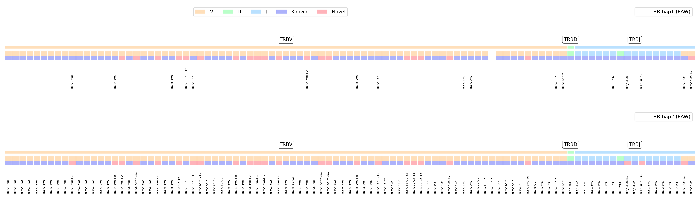

# VDJ Analize, Assamble and Annotate Pipeline (VDJ-AAAP)

## Table of content
- [VDJ Analize, Assamble and Annotate Pipeline (VDJ-AAAP)](#vdj-analize-assamble-and-annotate-pipeline-vdj-aaap)
  - [Table of content](#table-of-content)
  - [Authors](#authors)
  - [Abstract](#abstract)
  - [Installation](#installation)
    - [Base setup](#base-setup)
    - [Environment Setup](#environment-setup)
    - [Getting Started](#getting-started)
  - [Configuration settings](#configuration-settings)
    - [Basic configuration options](#basic-configuration-options)
    - [Important configuration settings](#important-configuration-settings)
  - [Output](#output)
    - [Annotation](#annotation)
  - [Plots](#plots)
    - [Single plots](#single-plots)
    - [Interactive plot](#interactive-plot)
      - [Activation](#activation)
      - [Options](#options)
      - [Interactive plot demo](#interactive-plot-demo)
  - [Acknowledgements](#acknowledgements)


## Authors

- [@Jesse mittertreiner](https://github.com/AntiCakejesCult)
- [@Giang Le](https://github.com/GiangLeN)

## Abstract
The VDJ-AAAP pipeline offers a robust framework for analyzing, assembling, and annotating long sequence reads from Pacific Biosciences (PacBio) and Oxford Nanopore Technologies (ONT). Designed to uncover both novel and known VDJ segments within T-cell receptors (TCR) or B-cell receptors/immunoglobulins (Ig), this part is still in beta. This versatile tool supports analysis across various species, given the availability of a reference genome and assembly report on NCBI. Configuration adjustments are facilitated through a user-friendly **`config.yaml`** file, enabling tailored pipeline functionality to suit specific research needs.

Addressing the challenge of assembling the repetitive VDJ regions, the pipeline selectively processes reads exceeding 5 Kbs, minimizing erroneous mappings and noise. It generates a refined reference genome, preserving only known chromosomes and specified fragments to prevent assembly inaccuracies. Utilizing minimap2, reads are meticulously mapped against this curated reference in a dual-phase approach tailored to each read type, ensuring accurate localization.

The assembly phase leverages the strengths of both PacBio and ONT reads, combining PacBio's precision with ONT's extensive read lengths for superior assembly outcomes. Specific genomic regions are then isolated using predefined flanking genes, with customization options available in the configuration file.

The pipeline extends its functionality to annotation, comparing assembled region sequences against a comprehensive library of non-novel VDJ segments sourced from the IMGT database or a pre-existing library in **`library/library.fasta`**. Outputs include detailed Excel reports on identified sequences, supplemented with an interactive plotting feature for enhanced data visualization and analysis.

## Installation

### Base setup
To use VDJ-AAAP, you need to have Conda ([Conda installation](https://conda.io/projects/conda/en/latest/user-guide/install/index.html)) and Python3 ([Python installation](https://realpython.com/installing-python/)) installed.

### Environment Setup

VDJ-AAAP requires a specific environment to run . You can install all necessary dependencies by setting up a Conda environment using the provided pipeline.yaml file.

  1. Open your terminal.
  2. Run the following command to create the Conda environment:
``` bash
conda env create -f pipeline.yaml
```

This command installs the following critical packages within the environment:

 1. mamba: A fast, flexible package manager that extends conda.
 2. singularity: A container platform focused on supporting "mobility of compute".
 3. snakemake: A workflow management system that helps to create and manage bioinformatics pipelines.

### Getting Started

To run the VDJ-AAAP pipeline, follow these steps:

 1. Download the pipeline source code from the GitHub repository:
 [TCR_macaque at BPRC-CGR](https://github.com/BPRC-CGR/TCR_macaque). Use the “Code” button and then select "Download ZIP".
 1. Extract the downloaded TCR_macaque-main.zip file to your desired location.
 2. Open your terminal and navigate to the extracted TCR_macaque-main directory. You can do this with the cd command followed by the path to the directory.
 3. Activate the Conda environment you created earlier by running:


``` bash
conda activate pipeline
```
If not created earlier run:
``` bash
conda env create -f pipeline.yaml
```
You are now ready to run the pipeline. Execute the pipeline using Snakemake by entering:

``` bash
snakemake -s Snakefile --cores --use-conda -pr
```

This command runs the pipeline using the default settings specified in config/config.yaml. The default is set for the analysis of the rhesus macaque, using Mmul10 as reference. 


## Configuration settings
The **config.yaml** file, located within the **config** directory, serves as the central place for customizing the pipeline's operation. This YAML file allows you to adjust various parameters to tailor the analysis to your specific requirements. 

### Basic configuration options
Below is an overview of the file's structure and the basic options you can configure:
``` yaml
ALL_CHROMOSOMES:
  - 1
  - "X"
  - "Y"

ASSEMBLY_CHROMOSOMES: 
  - 3
  - 7

HAPLOTYPES: 
  - 1
  - 2

SPECIES:
  name:
    "macaca mulatta"
  genome:
    GCF_003339765.1
  cell:
    TR

FLANKING:
  chr7:
    alpha-delta:
      start: SALL2
      end: DAD1
  chr3:
    beta:
      start: MGAM2
      end: TRPV6
    gamma:
      start: VPS41
      end: EPDR1
```

- **All_CHROMOSOMES**: This list contains all chromosomes found within the reference genome. For those uncertain of the specific chromosomes included in their reference genome, it's advisable to consult the [NCBI Genome database](https://www.ncbi.nlm.nih.gov/datasets/genome/). By default, the list covers chromosomes 1 through 20, in addition to the X and Y chromosomes. Adjustments to the **All_CHROMOSOMES** list should be made if your reference genome's chromosome composition differs.

- **ASSEMBLY_CHROMOSOMES**: Define the chromosomes for analysis by listing their numbers. This allows you to focus on specific chromosomes of interest.

- **HAPLOTYPES**: Specify the haplotypes to retrieve from the assembly. List each haplotype you wish to include in the analysis.

- **SPECIES: name**: Define the species being studied. For example, `"macaca mulatta"` for Rhesus macaque. Ensure the species name is enclosed in quotes.

- **SPECIES: genome**: Specify the genome that is being used for the run. It can be found on the [NCBI Genome database](https://www.ncbi.nlm.nih.gov/datasets/genome/). 
  
- **SPECIES: cell**: Indicate the cell type being analyzed. Set this value to either `TR` (T-cell receptor) or `IG` (Immunoglobulin), depending on your study's focus.

- **FLANKING**: Configure the flanking genes for extracting the necessary information. This section requires specifying the chromosomes (`chr7`, `chr3`, etc.), the regions within those chromosomes (`alpha-delta`, `beta`, `gamma`), and the `start` and `end` genes flanking the region of interest.
    - **start**: The gene marking the beginning of the region. If left as an empty string (`""`), the pipeline defaults to the start of the contig (position 0).
    - **end**: The gene marking the end of the region. If left as an empty string (`""`), the pipeline defaults to the end of the contig where the region is located.

### Important configuration settings
To enable accurate annotation of the VDJ gene segments, specifying the RSS layout is crucial. This ensures proper validation can be performed. There are three critical variables to adjust: **RSS_LAYOUT**, **RSS_LENGTH**, and **RSS_MERS**.

```yaml
RSS_LAYOUT:
  TRAV:
    "23":
      "+": end_plus
      "-": start_minus
  TRAJ:
    "12":
      "+": start_minus
      "-": end_plus

RSS_LENGTH:
  "12": 28
  "23": 39

RSS_MERS:
  "12": 
    - 9
    - 7
  "23": 
    - 7
    - 9

```
- **RSS_LAYOUT**: Dictates the identification approach for Recombination Signal Sequences (RSS) in relation to the VDJ gene segments. This configuration is crucial for determining the precise location of RSS for accurate gene segment annotation. Within this setting, you specify:
  - The segment type (e.g., `TRAV`, `TRAJ`) to configure.
  - The RSS type (`12`, `23`) indicating the spacer length in base pairs.
  - The orientation (`+`, `-`) for identifying the RSS direction in relation to the gene segment.
  - Methods of extraction (`start_minus`, `end_plus`) which define how the RSS is located and annotated based on its positional context to the VDJ segment.
    - `start_minus`: Extracts the RSS from the start (left side) of the VDJ segment, utilizing the segment's start coordinate and subtracting the RSS length to locate the RSS.
    - `end_plus`: Extracts the RSS from the end (right side) of the VDJ segment, using the segment's end coordinate and adding the RSS length to pinpoint the RSS.

- **RSS_LENGTH**: Specifies the length of each RSS type, classified by the spacer length (`12`, `23`). This length is essential for correctly identifying and annotating the RSS within the genomic sequence. The numbers (e.g., `28`, `39`) represent the total length in base pairs for each RSS type.

- **RSS_MERS**: Defines the positions of key components within the RSS - specifically, the heptamer and nonamer elements, denoted as `7` and `9`, respectively. This configuration allows for detailed specification of each RSS's structural components, critical for the annotation process. The lists under each RSS type (`12`, `23`) enumerate the preferred positions of these elements, facilitating precise identification and analysis of RSS structures within the genomic data.

## Output
The pipeline creates a lot of important files locateded in different directories. The next code sample shows the tree with all the directories that are created when running pipeline.
```txt
.
├── alignments
├── annotation
├── assembly
├── benchmarks
├── BUSCO
├── busco_downloads
├── chromosomes
├── config
├── converted
├── downloads
├── envs
├── final
├── flank_alignment
├── flanking
├── input
├── inspector
├── library
├── logs
├── mapping
├── QC
├── quast
├── results
├── region
├── RSS
├── scripts
└── split_files
```
### Annotation
One of the most important parts of the pipeline is the finding of novel VDJ gene segments. The result of the findings are located in the folder called **annotation**. In this directory, are the following excel files located.
```txt
annotation/
├── annotation_report_100%.xlsx
├── annotation_report_100%_plus.xlsx
├── annotation_report_long.xlsx
├── annotation_report_plus.xlsx
├── annotation_report.xlsx
├── blast_results.xlsx
└── report.xlsx
```
- **report.xlsx**: In the report file are all the initial mapping results, to get a initial understanding of the amount of VDJ gene segments that are identified. This includes non-novel and novel segments.
-  **blast_resutls.xlsx**: In the blast result are all the revaluated segments. This includes the deviation between found segment and the most similar. 
-  **annotation_report.xlsx**, **annotation_report_100%.xlsx**, **annotation_report_long.xlsx**: In the intial annotation report are all the novel segments that are retained after the filtering of the segments. The 100% version of the annotation report is almost the same as the original report, but this includes only the non novel segments. Lastly the long format is uncondesed version, where the similar sequences are not combined in one row.
-  **annotation_report_plus.xlsx** and **annotation_report_100%_plus.xlsx**: Lastly the annotation report plus reports contain validations columns based on the RSS types of the segments. This indicate the found RSS heptamer and nonamer for a given segment and the a RSS heptamer and nonamer that where used for comperison. The final report conatins the flowwing columns.

| Column                        | Explanation                                                                                                                                                                                                                                   |
| ----------------------------- | --------------------------------------------------------------------------------------------------------------------------------------------------------------------------------------------------------------------------------------------- |
| **Reference**                 | Name of the closest reference for the new segment.                                                                                                                                                                                            |
| **Old name-like**             | New segment's name, derived from the closest reference, appended with "like" to indicate similarity.                                                                                                                                          |
| **Mismatches & % Mismatches** | Number of mismatches with the reference and their percentage relative to the total length of the reference.                                                                                                                                   |
| **Start and End coord**       | Coordinates of the segment within the region of interest.                                                                                                                                                                                     |
| **Function**                  | Segment function: functional (F), open reading frame (ORF), or pseudogene (P) if an early stop codon is detected.                                                                                                                             |
| **Similar references**        | Other references for a segment with the same start and end coordinates; the best match is selected based on mutation count and reference name.                                                                                                |
| **Path**                      | Path to the FASTA file of the region containing the segment.                                                                                                                                                                                  |
| **Strand**                    | Orientation of the segment: 5' to 3' (`+`) or 3' to 5' (`-`).                                                                                                                                                                                 |
| **Region and Segments**       | Type of region and segment identified.                                                                                                                                                                                                        |
| **Haplotype**                 | Haplotype (1 or 2) on which the segment is found.                                                                                                                                                                                             |
| **Sample**                    | Name of the sample providing the genetic data.                                                                                                                                                                                                |
| **Short name**                | Only the part of the segment that includes the region, segment and variant.                                                                                                                                                                   |
| **RSS**                       | Each RSS spacer type includes six columns, with three dedicated to both the heptamer and nonamer segments. These columns represent the segment sequence, a reference sequence, and a boolean indicating if the segment matches the reference. |

## Plots 
This pipeline also creates individual plots and a interactive plot to showcase the results.

### Single plots


### Interactive plot
The interactive plot is automtically generated based on the results in the **annotation_report_plots.xlsx**.

#### Activation

Launch the interactive visualization by executing the following steps:

1. **Open Terminal**: Navigate to the `TCR_macaque-main` directory using your command line interface.
   
2. **Start Bokeh Server**: Enter the command below and press `Enter`:

    ```bash
    bokeh serve scripts/visualisation.ipynb
    ```

    Upon execution, you should see messages similar to these:

    ```
    2024-03-08 10:08:34,162 Starting Bokeh server version 3.3.0 (running on Tornado 6.3.3).
    2024-03-08 10:08:34,163 User authentication hooks NOT provided (default user enabled).
    2024-03-08 10:08:34,166 Bokeh app running at: http://localhost:5006/visualisation.
    2024-03-08 10:08:34,166 Starting Bokeh server with process id: 3759457.
    ```

3. **Access the Visualization**: Click on [http://localhost:5006/visualisation](http://localhost:5006/visualisation) or copy and paste this URL into your web browser.

4. **Deactivate**: To deactivate the application, press `⌃C` (Control + C) on MacOS or `Ctrl + C` on Windows in the command line interface.

#### Options

The interactive plot includes several controls to customize the display:

- **Region-Haplotype**: This dropdown menu lists regions containing different segments for various haplotypes. When choosing `All`, all regions will be shown.
- **Function**: A green toggle button following the dropdown. It allows for switching between displaying only segments classified as functional (F/ORF) and showing all segments (F/ORF & P).
- **New**: Another green toggle button enabling the option to display only novel segments or both novel and non-novel segments.


#### Interactive plot demo


## Acknowledgements
I would like to thank [Jesse Bruijnesteijn](https://github.com/JesseBNL) and [Susan Ott](https://github.com/SusanOtt) for their contributions and insights which have significantly enhanced the pipeline. Your expertise and suggestions have been really helpful in improving the pipelines functionality and effectiveness. Thank you both for your dedication and support.