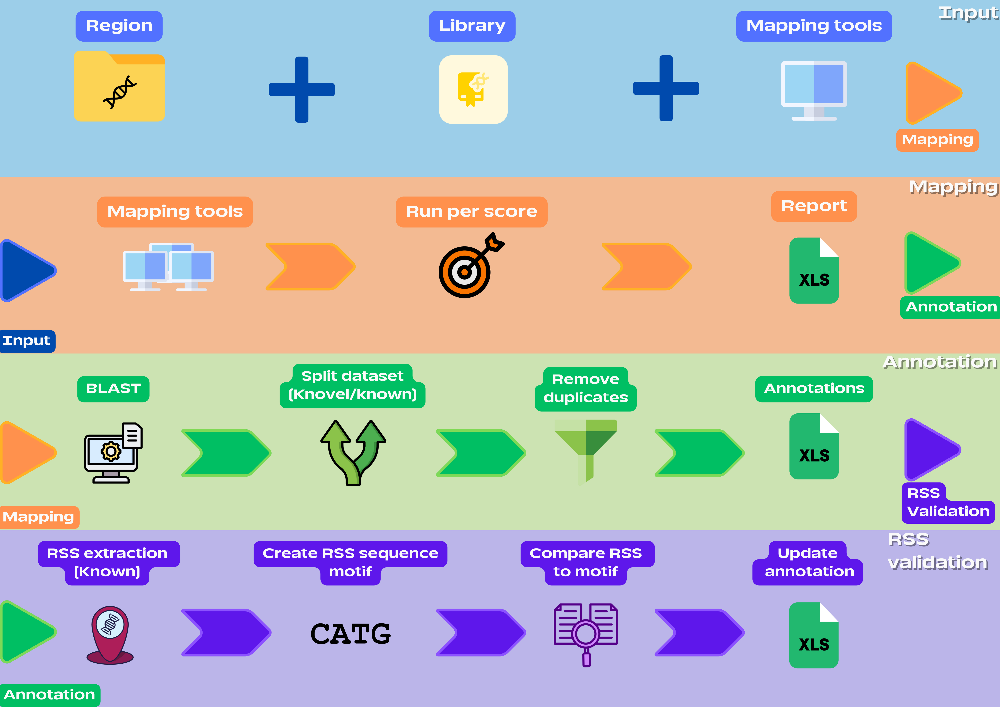

# Developers guide VDJ-AAAP pipeline

## Table of Contents

- [Developers guide VDJ-AAAP pipeline](#developers-guide-vdj-aaap-pipeline)
  - [Table of Contents](#table-of-contents)
  - [Authors](#authors)
  - [Introduction](#introduction)
  - [Environments and packages](#environments-and-packages)
    - [Snakemake environments](#snakemake-environments)
    - [Script environments](#script-environments)
    - [Package and module list](#package-and-module-list)
  - [Pipeline (Snakefile)](#pipeline-snakefile)
  - [Code explanation](#code-explanation)
  - [**IMGT Scraper**](#imgt-scraper)
    - [Usage](#usage)
  - [**Annotation**](#annotation)
    - [annotation.py](#annotationpy)
    - [map\_genes.py (map\_main)](#map_genespy-map_main)
    - [map\_genes.py](#map_genespy)
    - [mapping.py](#mappingpy)
    - [blast.py](#blastpy)
    - [report.py](#reportpy)
    - [RSS.py](#rsspy)
    - [Annotation tool usage](#annotation-tool-usage)
  - [V(D)J display](#vdj-display)
    - [VDJ\_display.py](#vdj_displaypy)
    - [reevaluate.py (BETA)](#reevaluatepy-beta)
    - [order\_segments.py (BETA)](#order_segmentspy-beta)
    - [Usage](#usage-1)

## Authors

- [@Jesse Mittertreiner](https://github.com/AntiCakejesCult)
- [@Giang Le](https://github.com/GiangLeN)

## Introduction

As can be read from the README this tool is devided in to two parts. The main pipeline which runs from the specified ONT and PacBio FASTQ file combined with a reference genome which can be either a fasta file or as a NCBI accesesion number. To read more on how to use the pipeline you can read the instruction in README under [pipeline](../README.md#pipeline).

The other option the tool has is to use the V(D)J annotation tool directly, normally this is used in the pipeline already but can also be run as standalone tool. To use it you must enter a directory with the assembly files as fasta file and library containing known V(D)J segments. More about this also be read in the README under [annotation](../README.md#annotation).

In this developers giode we discuss parts of the used scrips and Snakemake pipeline that are important, hard to understand or can be changed. Furthermore, the main packages and modules used are shown.

## Environments and packages

### Snakemake environments

The pipeline uses different rules to generate various results. These rules rely on environment files, which contain different packages. When looking at these environment files, you'll notice that some package entries appear multiple times across different files. This happens because you can't inherit packages from one environment to another, and Snakemake's **Conda** argument does not allow for multiple environment files to be used together.

### Script environments

To handle environment switching outside the use of Snakemake we have designed our **Conda** environment switching system. It works similar to the **Conda** keyword Snakemake uses. You need the same style of environment file (yaml file). Then you need to specify the code block you want to execute within a certain environment. You need to import [create_and_activate_env](../scripts/env_manager.py#L17) and [deactivate_env](../scripts/env_manager.py#L91) from the [env_manager.py](../scripts/env_manager.py). The following example shows the best way to use it, if you would like to add to other places.

```python
from env_manager import create_and_activate_env, deactivate_env
try:
    create_and_activate_env(Path('envs/scripts.yaml')) ## Creation and/or activation of the environment.
    code_to_run() ## Code that is run in the environment.
except Exception as e:
    print(f"Code failed with error: {str(e)}")
finally:
    deactivate_env() ## Deactivating of the environment.
```

### Package and module list

The following list contains all the different used packages and modules with version numbers. Changing the version of the packaged can be done in the individual envs as follow. Navigate to the [envs](../envs/) directory open environment file, for example [samtools](../envs/samtools.yaml) and change the number after the equal(=) sign like this.

``` bash
samtools=1.6 -> samtools=1.7
```  

The following table lists all the packages used in the tool. The columns are organized as follows:

- **Package**: The name of the package.
- **Version**: The version number of the package.
- **Program**: Specifies where the package is used. This can be:
  - **Global**: Usage include in tool shell, Python, or Snakemake.
  - **Pipeline**: Specific to the pipeline itself.
  - **Annotation tool**: Used within the annotation tool.
  - **VDJ display**: Used within the VDJ display tool.
  - **IMGT scrape**: Used within the IMGT scrape tool.

|Package          |Version  |Program                                 |
|-----------------|---------|----------------------------------------|
|beautifulsoup4   |4.12.3   |Annotation tool                         |
|inspector        |1.2      |Pipeline                                |
|matplotlib       |3.8.4    |VDJ display                             |
|python           |3.11     |Global                                  |
|python           |3.6      |Global                                  |
|requests         |2.31.0   |IMGT scrape                             |
|bedtools         |2.31.0   |Pipeline - Annotation tool              |
|biopython        |1.83     |Pipeline - Annotation tool - IMGT scrape|
|blast            |2.14.1   |Annotation tool                         |
|bowtie           |1.3.1    |Annotation tool                         |
|bowtie2          |2.5.1    |Annotation tool                         |
|busco            |5.5.0    |Pipeline                                |
|hifiasm          |0.19.8   |Pipeline                                |
|imagemagick      |7.0.11_12|Annotation tool                         |
|meme             |4.11.2   |Annotation tool                         |
|minimap2         |2.26     |Pipeline - Annotation tool              |
|ncbi-datasets-cli|15.25.0  |Global                                  |
|openpyxl         |3.1.2    |Global - Annotation tool                |
|pandas           |2.2.1    |Global - Annotation tool                |
|pyyaml           |6.0.1    |Global - Annotation tool                |
|quast            |5.2.0    |Pipeline                                |
|samtools         |1.6      |Pipeline - Annotation tool              |
|seqkit           |2.8.0    |Pipeline                                |
|seqtk            |1.4      |Pipeline                                |

## Pipeline (Snakefile)

For the pipeline itself, you can change settings in the [Snakemake file](../Snakefile) itself. But some values like the main [configuration file](../Snakefile#l6) (configfile) should not be altered. The configuration file is generated automatically after choosing the right arguments with the command line tool. It contains all the necessary information the pipeline needs to work properly. For more information about the configuration file please see the [Configuration settings](../README.md#configuration-settings) in the README.

From previous runs, it is known that sometimes the **kmer** and **window** needed to be added to achieve better results. These parameters can be added to the [command](../Snakefile#L365).

## Code explanation

We will also take a look at the code of the developed packages such as the custom created scripts/tools to produce the needed results. This includes the IMGT_scrape for the retrieval of known V(D)J segments from the IMGT database, the annotation tool for the annotation of V(D)J segments and lastly the VDJ_display for visualization of the V(D)J segments in right order. We will explain the main working of the different script for the developed tools.

## **IMGT Scraper**

This tool automates the retrieval of immunoglobulin (IG) and T-cell receptor (TR) V(D)J segment sequences from the IMGT database for specified species. It allows users to customize the sequence fetching process based on several parameters including species type, receptor type (IG or TR), and sequence frame, which is needed to change the types of segments to fetch. The script outputs the sequences in FASTA format per region and segment. Optionally, it can compile them into one fasta file a library. It removes the excess files by default.

### Usage

```bash
python imgt_scrape.py -S "Homo sapiens" -T IG --output /path/to/output --create-library --cleanup
```

For more information about this tool, please see the [README.md](https://github.com/BPRC-CGR/IMGT_scrape/tree/development)

## **Annotation**

This is the tool that is used to discover novel and known V(D)J segments, present on assembly data or contigs. It takes a generated assembly as fasta file, the assembly can either be phased or collapsed. You also need to add a library with known V(D)J segments, because novel segments are determined based on the segments. The type of receptor also need to be chosen either TCR or IG and lastly the species. The TCR version the best of the two because IG is still in BETA. The reason you need the choose the species and receptor is because the config file is generated based on these input, this is important for example the RSS validation. By default, it uses minimap2, bowtie and bowtie2 to do annotation. This is the best set tools to discover because of the different length of V(D)J segments. Minimap2 for the largest segments, the V (around 300 bps or larger), bowtie2 for the short segments, the J (between 50 bps to 300 bps) and lastly bowtie for the shortest sequences the D (between 1 and 50).



### annotation.py

`annotation.py` is the main script activated when running the annotation tool. It starts by validating the user inputs. It wil cut out the desired region (TCR or IG) based on the flanking genes in the config file. Then if verifies if **report.xlsx** exists if this is not the case it will run the mapping script to perform V(D)J segment mapping using user-specified tools. After it it performs the BLAST to check the amount of divergence of the known segment, it will write the initial findings to the **annotation_report.xlsx**, **annotation_report_100%.xlsx** excel files and does RSS validation updates the previous mentioned files with the RSS validation. This can be seen in the file name because it has a **_plus** suffix. The differed script will be explained below.

### map_genes.py ([map_main](../scripts/map_genes.py#))

In this script, the specified flanking genes from the config file are downloaded for the chosen species using the NCBI dataset package using the [download_flanking_genes](../scripts/map_genes.py#download_flanking_genes) function. Only the files containing the flanking genes are retained, while other unnecessary files are removed.

Next all the flanking genes are combined using the [combine_genes](../scripts/map_genes.py#combine_genes) function. It processes the files, ensuring they are in the correct format, and merges them into the `all_genes.fna` file. We support multiple FASTA file extensions, such as `.fna`, `.fasta`, and `.fa`. If you need more or fewer extension types, you can easily [modify](../scripts/map_genes.py#) the list of supported.

Once the flanking gene files are combined, the script proceeds to map them to the user-specified assembly files using [`minimap2`](../scripts/map_genes.py#map_flanking_genes). The [`-ax asm5`](../scripts/map_genes.py#map_flanking_genes) preset is selected because both the flanking genes and assembly files originate from the same species, ensuring a close match. The [`--secondary=no`](../scripts/map_genes.py#map_flanking_genes) option is used to avoid duplicate entries of flanking genes.

To refine the mapping results, an [`awk`](../scripts/map_genes.py#map_flanking_genes) statement is used to filter the output. This command retains only alignments with a high mapping quality (MAPQ = 60) and removes any duplicate entries based on the reference sequence and position. The filtered results are stored in a standard SAM file, for further analysis.

### map_genes.py

To extract the necessary regions (either TCR or IG), we use the previously generated SAM files. The process begins by looping over the [flanking genes](../scripts/extract_region.py#) list one pair at a time, ensuring accurate identification of flanking gene pairs. Simultaneously, the script iterates through the assembly files, using `pathlib`'s **glob** to locate relevant FASTA files with various extensions.

To handle the file names we use the [create_name](../scripts/extract_region.py#create_name) function, which parses filenames to extract details like chromosome, sample, and haplotype. This function is essential because we have phased and unphased assembly files and we need a flexable way to generate the file names. If a keywords is not found, the name fields remain blank.

The assembly data is stored into a dictionary using [make_record_dict](../scripts/extract_region.py#make_record_dict). This dictionary, created with `SeqIO` from the `biopython`, stores the different contig sequences or record by their ID. This dictionary is needed to cut the region(s) out when we retrieve the coordinates.

To get the coordinates we use the [get_positions_and_name](../scripts/extract_region.py#get_positions_and_name) function and this [**awk**](../scripts/map_genes.py#) command to extract the coordinates and contig names. It filters out the bitwise flags and alignment positions. This is stored as [**sam_list**](../scripts/extract_region.py#).

Next we select the best alignment of a flanking gene and get the right coordinates from the **sam_list**, the [get_best_coords](../scripts/extract_region.py#get_best_coords) function compares bitwise flags, which encode alignment information. By choosing the alignment with the lowest bitwise flag, we ensures that the most reliable alignment is chosen.

After we have chosen the coordinates we check if the [coordinates exists](../scripts/extract_region.py#) and if we have a [unique contig name](../scripts/extract_region.py#). If no coordinates are found, the region is skipped. If the contig name is unique, we known that the region is correctly located on a single contig. If the names are not unique, the region is not located on a single contig and is also skipped.

All the sequences from the intact regions are extracted from their corresponding assembly FASTA file and written to a new output file in FASTA format.

### mapping.py

The `mapping.py` script is used for identifying and extracting V(D)J segments using minimap2, bowtie2, and bowtie. It starts by loading configuration settings from a YAML file via the [`load_config`](../scripts/mapping.py#L15) function. If the config file is missing, the script logs an error and exits to prevent further execution without the necessary settings.

We handle the file management by the [`MappingFiles`](../scripts/mapping.py#L26) class, which sets up paths for the required files (Bowtie indices, SAM, BAM, and BED files) based on the selected mapping tool, to reduce the amount of redundant code.

Mapping commands are dynamically generated based on the accuracy score (`acc`). Functions like [`make_bowtie_command`](../scripts/mapping.py#L130), [`make_bowtie2_command`](../scripts/mapping.py#L170), and [`make_minimap2_command`](../scripts/mapping.py#L210) generate the necessary command for the specified mapping tool, with parameters adjusted for mismatches in Bowtie, seed length in Bowtie2, or accuracy thresholds in Minimap2. The mapping functions can be modified to tweak the mapping behavior. The range of accuracy scores used during mapping is configurable through the `start` and `stop` parameters in the [`mapping_main`](../scripts/mapping.py#L355) function.

Post-mapping, the [`parse_bed`](../scripts/mapping.py#L100) function processes the results. The segments are then extracted from assembly FASTA files using the [`get_sequence`](../scripts/mapping.py#get_sequence) function, which uses BED file coordinates to retrieve the relevant segments. The [`get_region_and_segment`](../scripts/mapping.py#get_region_and_segment) function categorizes these segments into regions and segments based on their names (**TRAV**), defaulting to "other" and "-" if the names don't match expected patterns. All the entries are stored in the `entries` list and returned.

These entries are compiled into a pandas DataFrame via the [`make_df`](../scripts/mapping.py#L255) function, with the output saved as `blast_results.xlsx`, which you can easily rename or format if needed.

### blast.py

To check how much divergence there is between the found segments and the one from the library we use the `blast.py` script. It automates BLAST searches against a specified database, which is the library. We utilize parallel processing because we process a large amount of segments.

We start by setting up the BLAST database through the [`make_blast_db`](../scripts/blast.py#L20) function. This function checks if the BLAST database already exists and creates it if necessary using the `makeblastdb` command. You can change the database creation settings and paths by modifying the `blast_db_path` and `command`.

Once the database is ready, we execute the `run_blast_operations` function, which runs the entire BLAST search and result aggregation. First we run the [`aggregate_blast_results`](../scripts/blast.py#L93) function to perform the BLAST searches for each segment in the DataFrame (which is parsed from `annotation.py`). `aggregate_blast_results` manages these searches in parallel and iterates over multiple identity cutoffs (100%, 75%, 50%). These can be changed if needed.

For each segmgent in the DataFrame, `aggregate_blast_results` calls the [`execute_blast_search`](../scripts/blast.py#L71) function. This function is responsible for creating temporary FASTA files and running the BLAST command. The BLAST command is constructed by the [`construct_blast_command`](../scripts/blast.py#L45) function, which customizes it based on the given parameters, such as identity `cutoff`, `sequence length`, and other options like word size and e-value. I would advise to only change the sequence length, this value is now chosen based on the average length of the D segment, because this one is harder for BLAST to find because it is small in length.

The results from each BLAST search are temporarily stored, then read into DataFrames within `aggregate_blast_results`. These DataFrames are combined into a single DataFrame, with a extra `cutoff` column. The temporary result files are deleted.

After aggregating the BLAST results, `run_blast_operations` further filters the data, retaining only entries with 100% query coverage. It also splits the query information to extract `start` and `stop` positions for each sequence. The filtered results are then saved to an Excel file, typically named `blast_results.xlsx`. You can change the name if needed.

### report.py

The `report_script.py` script processes BLAST results to categorize V(D)J segments, generating detailed reports that distinguish between known and novel sequences.

We first have the `report_main` function. This function first loads the necessary configuration settings via the [`load_config`](../scripts/report_script.py#L30) function and loads it into the global `CONFIG` variable. If the configuration file is missing, the script logs an error and exits to prevent further issues.

After successfully loading the configuration, `report_main` reads the sequence data from the specified library using the [`make_record_dict`](../scripts/report_script.py#L35) function, which creates a dictionary of the V(D)J segments library. This dictionary is essential for referencing the V(D)J sequences later in the process.

Next, the BLAST results, `blast_results.xlsx` are loaded from an Excel file into a DataFrame. The script then enhances this DataFrame by adding various computed values through the [`add_values`](../scripts/report_script.py#L105) function, including the percentage of mismatches (`% Mismatches of total alignment`), the lengths of the query and subject sequences (`query_seq_length` and `subject_seq_length`), and specific components from the query string, such as `start`, `stop`, `strand`, and `path`. These metrics are needed for filtering next.

The DataFrame is then filtered using the [`main_df`](../scripts/report_script.py#L75) function, which removes entries with `alignment gaps` or `100% identity`, retaining only those likely to contain novel sequences. Entries with `100% identity` are stored separately in a reference DataFrame.

Following this initial filtering, further processing is applied through the [`run_like_and_length`](../scripts/report_script.py#L255) function, which add `-like` suffix to the novel segments. We also add other relevant columns like `Region`, `Segment`, `Short name` and `Library Length`, and ensures that only entries with consistent sequence lengths across references are retained.

The [`add_orf`](../scripts/report_script.py#L195) function then assesses whether the sequences can be translated into functional proteins, to determine the initial function. It translates each segment sequence and checks for stop codons position, and assigns a "Function" to each segment labeling them as "F/ORF" (Functional/Open Reading Frame) if they are (potentially) functional, "P" (Pseudogene) if they contain premature stop codons, or "PF/ORF" (Potentially Functional/Open Reading Frame) if the sequence might be functional but it is to difficult to properly determine. Additionally, it generates messages for sequences where stop codons are in critical positions.

The script then applies the [`filter_df`](../scripts/report_script.py#L107) function within the [`group_similar`](../scripts/report_script.py#L285) function to improve the dataset by selecting the most relevant reference sequences based on specific criteria, such as
criteria:

- **Specific part identification**: The function combines the "Region" and "Segment" values from each row to form a "Specific Part," which is used to identify sequences that closely match the query conditions.
- **Reference selection**: It filters rows based on the presence of this specific part in the "Reference" column, giving priority to entries where the reference sequence length matches that of the query sequence.
- **Optimal reference determination**: Among the filtered rows, the function selects the one with the fewest mismatches, sorting by the reference identifier to choose the best match. If no specific matches are found, the function defaults to the first row.
- **Compilation of similar references**: After selecting the best reference, the function compiles a list of all other references that were not selected, providing additional context for potential alternative annotations.

After selecting the optimal reference, the script compiles similar references for additional context.

Finally, we prepare and formate the data for export to the different Excel files. The [`annotation_long`](../scripts/report_script.py#L283) function exports the unfiltered data to `annotation_report_plus.xlsx`, while the [`annotation`](../scripts/report_script.py#L325) function generates two key reports: `annotation_report.xlsx` for novel matches and `annotation_report_100%.xlsx` for known matches. These reports provide a comprehensive overview of the data, including detailed information such as start and stop coordinates, function, similar references, and messages indicating potential issues with the sequences.

### RSS.py

The `RSS_script.py` script is the script used for validation V(D)J segments, based on the RSS heptamers and nonamers. The script is designed to load configuration settings, extract RSS sequences from V(D)J segments, validate these sequences against known reference motifs, and generate detailed annotation reports that include information on RSS matching.

The process begins with the `RSS_main` function, by setting up the configuration settings through the [`load_config`](../scripts/RSS_script.py#load_config) function. Storing the important settings in the global `CONFIG` variable. It also populates the `OPTIONS` variable with RSS layouts for the different segments.

After loading the configuration, the script checks for the existence of the two Excel files: `annotation_report.xlsx` and `annotation_report_100%.xlsx`. These files contain data on novel and known V(D)J segments, respectively. The [`check_if_exists`](../scripts/RSS_script.py#check_if_exists) function ensures these files are present before the script proceeds. The script then loads these files into DataFrames (`df1` and `df2`).

The next step involves generating RSS heptamer and nonamer sequences and the sequence motifs. The [`create_all_RSS_meme_files`](../scripts/RSS_script.py#create_all_RSS_meme_files) function creates the directories for storing RSS heptamer and nonamer sequences and MEME sequence motifs for both novel and known sequences. The script generates RSS sequences by extracting specific heptamers and nonamers from the V(D)J segments using the [`fetch_sequence`](../scripts/RSS_script.py#fetch_sequence) function. This function calculates the start and end positions of RSS heptamer and nonamer based on the configuration settings, we also take in to account the segment, region and the segment's orientation (strand). The [`rss_type`](../scripts/RSS_script.py#rss_type) function is crucial to determine whether the sequence should be extracted from the start or end of the segment, depending on orientation.

Once the RSS sequences are generated, they are saved as FASTA files in a directory structure organized by region and segment, like this **TRAV.fasta**. The [`write_fasta_file`](../scripts/RSS_script.py#write_fasta_file) function handles this. Then we use the MEME suite to identify motifs within the heptamer and nonamer sequences. The generated motifs are stored. To run MEME we use the [`run_meme`](../scripts/RSS_script.py#run_meme) function, constructing the appropriate MEME commands based on the number of sequences present in each FASTA file. We use, the command uses options like `-dna` to specify DNA sequences, `-mod zoops` or `-mod anr` to define the distribution of motifs, and `-minw` to set the minimum motif width, corresponding to the length of the RSS variant (either 12 bp or 23 bp). The choice between using `-mod zoops` (Zero or One Occurrence Per Sequence) or `-mod anr` (Any Number of Repetitions) depends on whether multiple sequences are expected in the FASTA file, with `-mod zoops` typically used when analyzing sequences that might contain a single motif.

We use a regular expressions to identify the heptamer and nonamer motifs within the RSS regex sequences. The [`get_reference_mers`](../scripts/RSS_script.py#get_reference_mers) function extracts these motifs by applying regex patterns that match the heptamer and nonamer sequences within the larger RSS context. For example, the function looks for patterns such as `[ACGT]{7}` for heptamers and `[ACGT]{9}` for nonamers, where `[ACGT]` matches any of the four DNA bases and the numbers indicate the length of the motif. These reference regex pattern are stored in a reference dictionary (`ref_rss_dict`) for later comparison.

Next we do the actual validation. We compare the identified RSS sequences from novel segments to the reference motifs stored in the `ref_rss_dict`, which is created by the [`make_reference_rss`](../scripts/RSS_script.py#make_reference_rss) function. This dictionary stores the heptamer and nonamer motifs for each segment type and region, based on the results from the MEME analysis. 

We run the validation with the [`update_df`](../scripts/RSS_script.py#update_df) function to apply the RSS validation process across all segments in the DataFrame. This function iterates over each row in the DataFrame, calling the [`check_ref_rss`](../scripts/RSS_script.py#check_ref_rss) function to validate the heptamer and nonamer motifs of the novel sequences against those stored in the reference dictionary. The [`rss_mismatch`](../scripts/RSS_script.py#rss_mismatch) function is used within this process to count the number of mismatches between the novel segment and the reference motif. It breaks down the RSS sequence into individual bases and compares each base to the corresponding base in the reference motif. If the total number of mismatches exceeds the threshold (one mismatch is allowed), the sequence is marked as a `False` otherwise as `True`. The results of this validation are stored in new columns in the DataFrame, indicating whether each sequence’s heptamer and nonamer sequence match the reference motif.

After the validation step, the script generates updated Excel reports using the [`create_rss_excel_file`](../scripts/RSS_script.py#create_rss_excel_file) function. These reports, saved as `annotation_report_plus.xlsx` and `annotation_report_100%_plus.xlsx`, contain the new information about each segment, including the validated RSS motifs. The [`combine_df`](../scripts/RSS_script.py#combine_df) function merges the data with the original DataFrame, ensuring that all relevant information is included in the final reports.

### Annotation tool usage

To use the tool, you can use the following command. More information about the tool's command and settings are available on the [`README`](https://github.com/BPRC-CGR/VDJ_segment_discover/tree/devlopment) on GitHub page for the tool itself.

```bash
python annotation.py --input /path/to/sequence_data_directory --library /path/to/reference_library.fasta --output /path/to/output_directory
```

## V(D)J display

Tool to nicely visualize V(D)J segments on their haplotypes. Giving the ability to show the two haplotypes at once or all single. The tool also has the ability to redetermine the order of the segments using **`--re-evaluate`**, this option is still in beta.

### VDJ_display.py

The `VDJ_display.py` script is essential for generating various V(D)J segment plots. It starts by processing user input with the [`parse_arguments`](../scripts/VDJ_display.py#L422) function. Next, the file paths are cleaned up by removing any extraneous separators.

The script uses the `PlotGenerator` class to handle everything from data loading to the final visualization output. Upon initialization, `PlotGenerator` sets up necessary configurations such as color schemes corresponding to different genomic segments and prepares the output directory for storing generated plots.

Extra color schemes can be added by creating an extra a dictionary in [`color_themes`](../scripts/) dictionary. Make sure you also add it in the [`choices`](../scripts/) in the `--color-theme`.

Data processing begins with the `load_dataframe` function that parses data from provided Excel files into a single dataset. This dataset is then processed by unique regions through the [`process_region_data`](../scripts/VDJ_display.py) method.

The [`process_region`](../scripts/VDJ_display.py) function checks for any entries with misclassified files, where segments appear in files where they logically shouldn't. Simultaneously, the `add_filter` function refines the segment names by removing unnecessary characters, making the data easier to manage for plotting.

Depending on user settings, the script runs either [`run_seperate_haplotype`](../scripts/VDJ_display.py) for single haplotype visualizations or [`run_combined_haplotype`](../scripts/VDJ_display.py) for combined plots. The data is sorted by "Start coord" for plot creation. For combined configurations, `align_lists_by_matching` is used to synchronize two lists of genomic segments by inserting blanks to address mismatches.

Footers are dynamically determined; for single plots, `Short names` are used directly, while for combined plots, the [`generate_footer_lists`](../scripts/VDJ_display.py) method creates two lists for each haplotype based on start coordinates—one where segment values match and another where they differ. This also uses the `Short names`.

The `calculate_plot_size` function adjusts plot dimensions based on the number of segments. It returns the **block size, block spacing, width per block, font size**. The plot structure is then created by the [`configure_plot`](../scripts/VDJ_display.py) function, which calls the functions to calculate the total width needed and sets up the plotting area with `initialize_plot`. The `add_segment_blocks` method creates two blocks using `create_dual_color_features`, differentiating 'V', 'D' and 'J' for the top block and 'Novel' and 'Known' for the bottom block.

Legends are added through `add_legends`, which creates a legend for sample and haplotypes and other for the colored blocks. Additionally, an optional footer can be added to provide further details or context about the data being visualized with [`add_footer`](../scripts/).

The `save_plot` method ensures each plot is saved in the designated directory. For combined plots, `combine_and_save_plots_vertically` merges the two plots into a single image by converting them to NumPy arrays, aligning them vertically, and then saving the unified plot.

### reevaluate.py (BETA)

### order_segments.py (BETA)

### Usage

To use this tool, you can use the following command. For more information, please read the [README](https://github.com/BPRC-CGR/VDJ_display/tree/development) on its GitHub page.

```bash
python VDJ_display.py --files path/to/file1.xlsx path/to/file2.xlsx --output_dir path/to/output --style combined
```
